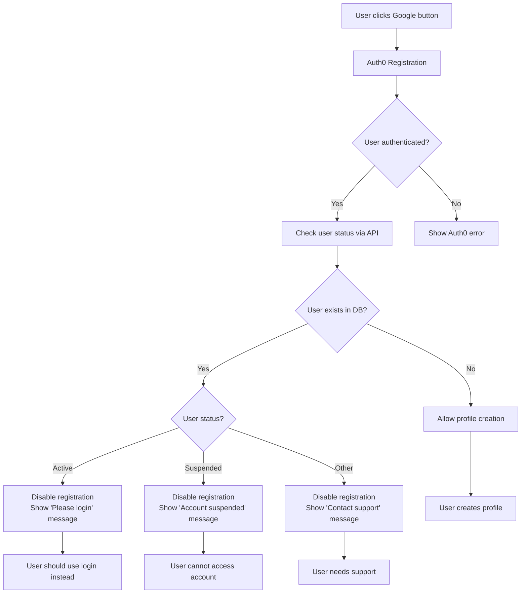

# Smart User Registration with Status Checking - Implementation Guide

## Overview
The authentication system now intelligently handles user registration by checking user status after Auth0 authentication and providing appropriate responses based on user status (active, suspended, new).

## New Features Added

### 1. User Status Checking
- **`checkUserExists(email)`**: Returns user data if exists, false if not
- **`checkUserStatus(email)`**: Returns comprehensive status information including:
  - `exists`: boolean - whether user exists
  - `canRegister`: boolean - whether registration is allowed
  - `canLogin`: boolean - whether login is allowed  
  - `status`: string - user status (active, suspended, etc.)
  - `message`: string - user-friendly message

### 2. Smart Registration Flow
- **Original UI Preserved**: SignupOption component keeps original simple interface
- **Post-Auth Validation**: User status is checked after Auth0 authentication
- **Dynamic Button Control**: Registration button is disabled based on user status
- **Status-Based Messaging**: Different messages for different scenarios

### 3. User Status Scenarios

#### Scenario 1: New User (No Account)
```
User clicks "Google" → Auth0 registration → No existing account → Profile creation allowed ✅
```

#### Scenario 2: Existing Active User
```
User clicks "Google" → Auth0 registration → Active account found → 
Button disabled + Message: "Email is already registered. Please try to sign in instead." ⚠️
```

#### Scenario 3: Suspended User
```
User clicks "Google" → Auth0 registration → Suspended account found → 
Button disabled + Message: "This account has been suspended and cannot be accessed." ❌
```

## Implementation Details

### Updated Components

#### SignupOption Component
- **Enhanced Props**: Now accepts `disabled` and `errorMessage` props
- **Conditional Styling**: Button appearance changes when disabled
- **Error Display**: Shows status-specific error messages
- **Original UI**: Maintains the simple Google sign-in interface

#### Join Component
- **Post-Auth Checking**: Validates user status after Auth0 authentication
- **State Management**: Tracks registration errors and disabled states
- **Dynamic Rendering**: Passes appropriate props to SignupOption

#### AuthProvider Context
- **Enhanced Status Checking**: Comprehensive user status validation
- **Multiple Protection Layers**: Checks during both registration and profile creation
- **Detailed Error Handling**: Status-specific error messages and actions

### Authentication Flow



### API Integration

#### User Status Check
```javascript
GET /api/user/{emailaddress}

Response for existing user:
{
  "id": "user123",
  "email": "user@example.com", 
  "status": "active", // or "suspended"
  "name": "John Doe",
  // ... other user data
}

Response for non-existing user:
404 Not Found
```

#### Profile Creation
```javascript
POST /api/user
{
  "email": "user@example.com",
  "name": "John Doe",
  // ... profile data
}

Success: 201 Created
Duplicate: 409 Conflict
```

## User Experience

### Before Implementation
- Users could register multiple times with same email
- No feedback about existing accounts
- Confusing duplicate account scenarios

### After Implementation  
- **Smart Detection**: System detects existing users automatically
- **Clear Guidance**: Users get specific instructions based on their status
- **Prevented Actions**: Registration button disabled when inappropriate
- **Status Awareness**: Different handling for active vs suspended accounts

### Status-Specific Messages

#### Active User Message
```
"Email is already registered. Please try to sign in instead."
[Registration Disabled Button]
```

#### Suspended User Message  
```
"This account has been suspended and cannot be accessed."
[Registration Disabled Button]
```

#### New User Experience
```
[Normal Google Button - Enabled]
→ Auth0 Registration → Profile Creation
```

## Error Handling

### Client-Side Protection
- User status validation after Auth0 authentication
- Dynamic UI updates based on status
- Clear error messaging
- Button state management

### Server-Side Protection  
- API endpoint validation
- Status-based access control
- Proper HTTP status codes
- Comprehensive error responses

## Benefits

1. **Intelligent User Guidance**: Users know exactly what to do based on their account status
2. **Prevents Confusion**: No more "why can't I register?" scenarios
3. **Maintains Security**: Suspended users can't access the system
4. **Clean Data**: Prevents duplicate account creation
5. **Better UX**: Original simple interface with smart backend logic
6. **Status Awareness**: System understands and responds to user account states

## Technical Implementation

### Files Modified
- `AuthProvider.jsx`: Enhanced with status checking logic
- `AuthContext.jsx`: Added new function signatures
- `SignupOption.jsx`: Added props for disabled state and error messages
- `Join.jsx`: Added post-authentication status checking

### New Functions
```javascript
// Enhanced user checking
checkUserStatus(email)         // Returns comprehensive status info
checkUserExists(email)         // Returns user data or false
checkEmailAvailability(email)  // Returns registration availability

// Enhanced profile creation
createUserProfile(profileData) // Includes status checking protection
```

This implementation provides intelligent user registration handling while preserving the original clean UI and adding comprehensive backend logic for user status management.
